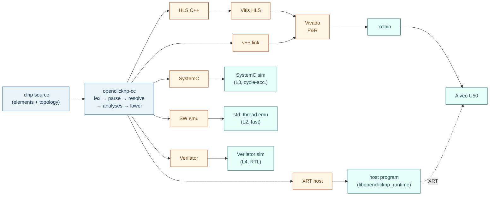

# OpenClickNP

[](https://github.com/bojieli/OpenClickNP/actions/workflows/ci.yml)
[](LICENSE)

A clean-room, open-source implementation of the system described in:

> Bojie Li, Kun Tan, Layong (Larry) Luo, Yanqing Peng, Renqian Luo,
> Ningyi Xu, Yongqiang Xiong, Peng Cheng, Enhong Chen.
> **"ClickNP: Highly Flexible and High-performance Network Processing
> with Reconfigurable Hardware."** ACM SIGCOMM 2016.

OpenClickNP is a high-level FPGA programming framework for network
functions. You write a network application as a graph of communicating
elements in a small DSL; OpenClickNP compiles it to AMD/Xilinx Alveo
U50 hardware, with optional software, SystemC, and Verilator
simulation backends.

This project is a clean-room reimplementation: every line of source is
written from the published paper as the only specification. It is
licensed under Apache-2.0.

## Architecture at a glance



The same `.clnp` source compiles to all six backends without
modification — element bodies are passed through opaquely. See
[`docs/architecture.md`](docs/architecture.md) for the full picture.

## Status

v0.1. The compiler, runtime, element library (123 elements across 9
categories), and 47 end-to-end applications are in place; all 47 apps
pass place-and-route on the U50 die at 322 MHz with zero CDC violations.
See [`FINAL_REPORT.md`](FINAL_REPORT.md) for measured numbers and
[`PLAN.md`](PLAN.md) for the full design.

## Quick start

### Prerequisites

- Ubuntu 22.04 LTS
- CMake ≥ 3.22
- gcc-11+ or clang-14+
- (Optional, for L3/L4/L5) AMD Vivado/Vitis 2025.2, XRT ≥ 2.16,
  Verilator ≥ 5.018, SystemC ≥ 2.3.4

### Build the compiler and runtime

```bash
git clone https://github.com/bojieli/OpenClickNP.git
cd OpenClickNP
cmake -B build -DCMAKE_BUILD_TYPE=Release
cmake --build build -j
ctest --test-dir build
```

This builds `openclicknp-cc`, the runtime library, and runs the L1 unit
+ L2 emulator tests (≈135 tests; the SystemC/Verilator smokes auto-enable
when those tools are installed).

### Compile and simulate an example (no FPGA needed)

```bash
./scripts/sim/run_emu.sh examples/PassTraffic
```

### Build a real bitstream (Vitis 2025.2 + Alveo U50 required)

```bash
./scripts/build/compile.sh   examples/PassTraffic --platform u50_xdma
./scripts/build/synth_kernels.sh examples/PassTraffic
./scripts/build/link.sh      examples/PassTraffic
./scripts/build/implement.sh examples/PassTraffic
```

Output: `build/PassTraffic/PassTraffic.xclbin`.

### Run on a real Alveo U50

```bash
./scripts/run/program_fpga.sh build/PassTraffic/PassTraffic.xclbin
./scripts/run/run_example.sh examples/PassTraffic
```

## Repository tour

```
compiler/    — openclicknp-cc, the .clnp DSL → multi-target compiler
runtime/     — libopenclicknp_runtime, host-side library
elements/    — standard element library (123 elements, 9 categories)
shell/       — Vivado/Vitis platform integration for U50 (XDMA + QDMA)
tests/       — L1 unit, L2 emulator, per-element behavioral tests, smokes
examples/    — 47 end-to-end demo applications
eval/        — reproducible HLS / P&R / CDC / throughput / latency runs
scripts/     — build / run / sim / platform-install scripts
docs/        — architecture, compiler internals, language reference
```

## Documentation

- [`docs/getting_started.md`](docs/getting_started.md) — zero to bitstream
- [`docs/language.md`](docs/language.md) — `.clnp` DSL reference
- [`docs/architecture.md`](docs/architecture.md) — system layers
- [`docs/compiler_internals.md`](docs/compiler_internals.md) — compiler walkthrough
- [`docs/verification_levels.md`](docs/verification_levels.md) — L1–L5 test pyramid
- [`PLAN.md`](PLAN.md) — full design plan
- [`FINAL_REPORT.md`](FINAL_REPORT.md) — measured results (resources, P&R, CDC)

## License

Apache-2.0. See [LICENSE](LICENSE).

## Citation

If you use OpenClickNP in academic work, please cite both the original
ClickNP paper (linked above) and this implementation.
